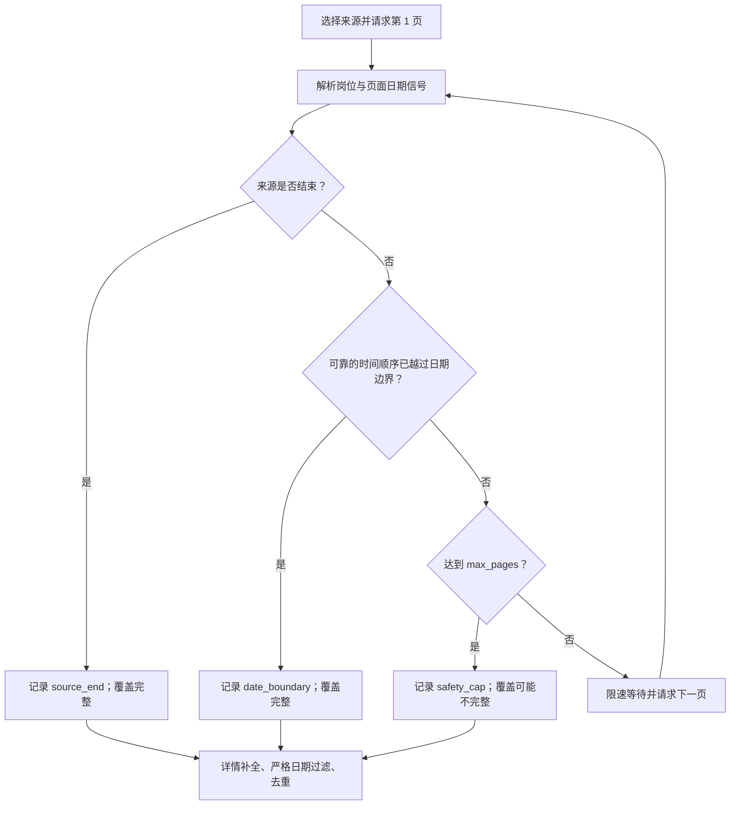

# 数据抽检与日期自动分页

## 一眼看懂



`--pages=auto` 不会仅仅把固定页数换成一个很大的数字。它会记录每个平台
为什么停止，以及这次扫描能否宣称覆盖完整。

## 运行最近 30 天扫描

```bash
jpjobs \
  --sources=all \
  --days=30 \
  --pages=auto \
  --max-pages=50 \
  --fetch-details \
  --output=jobs.json
```

`--max-pages` 是每个平台、每组查询的安全上限。调高它会提高可能的覆盖率，
但也会增加请求量、运行时间和详情页补全成本。

输出中每个平台包含：

- `pages_fetched`：实际获取的页面数；
- `pagination_stop_reasons`：`date_boundary`、`source_end`、
  `server_filtered_end`、`safety_cap`、`repeated_page` 等；
- `coverage_complete`：是否有证据表明已经走完日期窗口或来源。

`coverage_complete=false` 不代表已返回的数据无效，只表示安全上限之外可能
还有符合日期条件的岗位。

## 各平台当前策略

| 平台 | 自动分页依据 |
|---|---|
| HelloWork | 浏览器翻页和列表受付日期；岗位量大时可能触发安全上限 |
| LinkedIn（显式可选） | 默认排除；公共访客岗位的信息质量不足，仅在明确指定时运行 |
| TokyoDev | 单个列表响应返回全部库存，不需要翻页 |
| JapanDev | Algolia 默认结果不是严格日期排序，因此自动模式遍历整个索引或到安全上限 |
| Daijob | 使用 Activated date 排序，并探测每页最旧岗位的详情日期 |
| GaijinPot | 使用 latest 排序，结合列表日期和站点下一页标记 |
| JobsInJapan | 使用日期排序和列表相对时间，并识别站点下一页 |
| Green | 使用更新顺序和列表内更新时间信号 |
| Forkwell | 使用新着顺序，并探测每页最旧岗位的结构化发布日期 |
| Wantedly | 使用 recent 顺序和真实 offset 结果，排除页面缓存中的推荐岗位 |

## 生成省事的人工抽检页面

```bash
python experiments/build_audit_report.py jobs.json \
  --per-source=20 \
  --output=audit/index.html
```

直接用浏览器打开 `audit/index.html`。页面会：

- 按平台均匀抽取最多 20 条，而不是只取结果顶部；
- 显示解析出的日期、地点、薪资、雇佣类型、语言和描述；
- 一键打开原始岗位页面；
- 标记“正确”“有问题”或“无法判断”；
- 勾选具体问题字段并填写备注；
- 自动保存在当前浏览器的 `localStorage`；
- 导出一份可继续统计的 JSON 审核结果。

浏览器保存只发生在本机。清除浏览器站点数据或点击“清空审核”会删除尚未
导出的选择，所以完成一部分后建议定期点击“导出审核结果”。

## 本轮抽检文件

当前优化结果生成的自包含页面位于：

`artifacts/audit-2026-07-23/index.html`

它从 397 条岗位中抽取 136 条：

- 数据不足 20 条的平台全部纳入；
- 数据超过 20 条的平台沿日期顺序均匀抽样；
- 没有合格结果的平台仍显示为 0，方便发现来源覆盖问题。

自动分页的受控在线验证记录在
`artifacts/auto-pagination-validation-2026-07-23.json`。测试验证了站点末尾、
日期边界、安全上限和重复页面四类停止路径。
