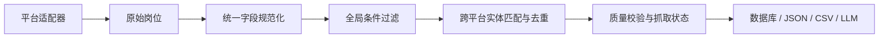

# jpjobs 0.2.0 架构与数据流程

本文描述 `jpjobs` 从接收搜索参数、抓取各招聘平台，到聚合和导出岗位信息的实际运行逻辑。

> 总体结构：多个独立平台爬虫 → 转换为统一 `Job` 对象 → 简单聚合与去重 → 格式化输出。

## 主流程

```mermaid
flowchart TD
    A["用户调用<br/>jpjobs CLI / Python API"] --> B["cli.py<br/>解析命令行参数"]

    B --> B1["搜索参数<br/>keywords · prefecture · location<br/>days · pages · employment type<br/>language · english filter"]
    B --> B2["输出参数<br/>json · csv · markdown<br/>table · llm"]

    B1 --> C["aggregate.scan()"]

    C --> D{"选择数据源"}

    D -->|"sources=all 默认行为"| D1["加载全部 17 个源<br/>10 active + 7 experimental<br/>⚠️ 实验源也会运行"]
    D -->|"指定 sources"| D2["只加载指定平台"]

    D1 --> E
    D2 --> E

    E["构造统一 opts 字典<br/>将所有搜索参数传给每个 Source"] --> F["Semaphore 限制并发<br/>默认 concurrency = 2"]

    F --> G["asyncio.gather()<br/>并发执行各平台 scan()"]

    subgraph SOURCES["平台抓取层"]
        direction LR

        H1["HTTP 抓取<br/>httpx + selectolax<br/><br/>LinkedIn · TokyoDev · JapanDev<br/>Daijob · GaijinPot · JobsInJapan<br/>Green · Forkwell · Wantedly"]

        H2["浏览器抓取<br/>Playwright + Chromium<br/><br/>HelloWork · Indeed"]

        H3["实验性 HTTP 源<br/><br/>CareerCross · Doda · JREC-IN<br/>Otta · Wellfound · enworld"]
    end

    G --> H1
    G --> H2
    G --> H3

    H1 --> I["请求搜索页或公开接口"]
    H2 --> J["打开网页<br/>填写表单 / 执行页面 JavaScript"]
    H3 --> I

    J --> J1["HelloWork 特殊处理<br/>选择都道府县和雇佣类型<br/>⚠️ 职业分类固定为 IT 大类"]
    J1 --> K

    I --> I1["⚠️ 各源实际支持参数不同"]
    I1 --> I2["LinkedIn<br/>keyword · location · days<br/>pages · employment type"]
    I1 --> I3["Indeed<br/>keyword · location · pages"]
    I1 --> I4["多数其他平台<br/>基本只读取 keyword<br/>prefecture / days / pages 等常被忽略"]

    I2 --> K
    I3 --> K
    I4 --> K

    K["解析搜索结果列表<br/>HTML 卡片 / JSON / Next.js 数据"] --> L["每个平台自行构造 Job"]

    L --> L1["统一 Job 外形<br/>title · company · workplace<br/>wage · date · language · URL"]
    L --> L2["⚠️ 不抓详情页<br/>多数 description / wage / date 为空"]
    L --> L3["⚠️ 没有全局规范化步骤<br/>字段质量取决于各 Source 的解析器"]

    L1 --> M{"平台执行结果"}
    L2 --> M
    L3 --> M

    M -->|"异常抛到 aggregate"| M1["记录 source error<br/>加入 warnings"]
    M -->|"Source 内部捕获异常"| M2["返回空列表<br/>⚠️ 最终可能显示扫描成功且无 warning"]
    M -->|"成功"| N["得到多个 list[Job]"]

    M1 --> N
    M2 --> N

    N --> O["聚合所有岗位"]

    O --> P["生成岗位 ID<br/>sha1(source + source_id)"]

    P --> Q{"by_id 中是否存在"}

    Q -->|"不存在"| Q1["保留岗位"]
    Q -->|"存在"| Q2["合并 found_on"]

    Q2 --> Q3["⚠️ 因为 ID 包含 source<br/>不同平台的同一岗位 ID 必然不同<br/>所以跨平台去重基本不会发生"]

    Q1 --> R["生成 ScanResult"]
    Q3 --> R

    R --> R1["jobs"]
    R --> R2["per_source 统计"]
    R --> R3["warnings"]
    R --> R4["scanned_at"]

    R1 --> S["output.format_result()"]
    R2 --> S
    R3 --> S
    R4 --> S

    S --> T1["JSON<br/>完整结构"]
    S --> T2["CSV<br/>扁平字段"]
    S --> T3["Markdown / Table<br/>人工查看"]
    S --> T4["LLM 文本<br/>⚠️ 只取前 50 条<br/>不含完整职位描述<br/>也不做跨平台均衡"]

    T1 --> U["用户保存、分析<br/>或交给 AI"]
    T2 --> U
    T3 --> U
    T4 --> U
```

## 关键模块

| 模块 | 责任 |
|---|---|
| `cli.py` | 解析命令行参数，调用扫描器并选择输出格式 |
| `aggregate.py` | 加载数据源、控制并发、收集结果、去重和生成统计 |
| `sources/*.py` | 访问各招聘平台并将页面数据转换为 `Job` |
| `schema.py` | 定义 `Job`、`Wage`、`ScanResult` 等统一数据结构 |
| `location.py` | 保存日本都道府县代码和名称映射 |
| `output.py` | 将扫描结果转换为 JSON、CSV、Markdown、表格或 LLM 文本 |
| `util/fetch.py` | 提供基于 `httpx` 的 HTTP 请求封装 |
| `util/browser.py` | 延迟启动并复用 Playwright Chromium |

## 当前架构的主要缺口

1. 各数据源没有共享的后置筛选层，相同搜索参数在不同平台上的效果不一致。
2. 岗位字段由各 Source 独立解析，没有统一的地点、日期、工资和语言规范化流程。
3. 岗位 ID 包含来源名称，无法识别不同平台上的同一职位。
4. 大多数来源只抓取列表页，缺少职位描述、技能、签证、语言和远程政策等详情。
5. 部分 Source 会在内部吞掉异常并返回空列表，聚合层可能无法区分“没有岗位”和“抓取失败”。
6. LLM 输出直接截取前 50 条，没有相关性排序或平台均衡。

## 推荐的目标流程

