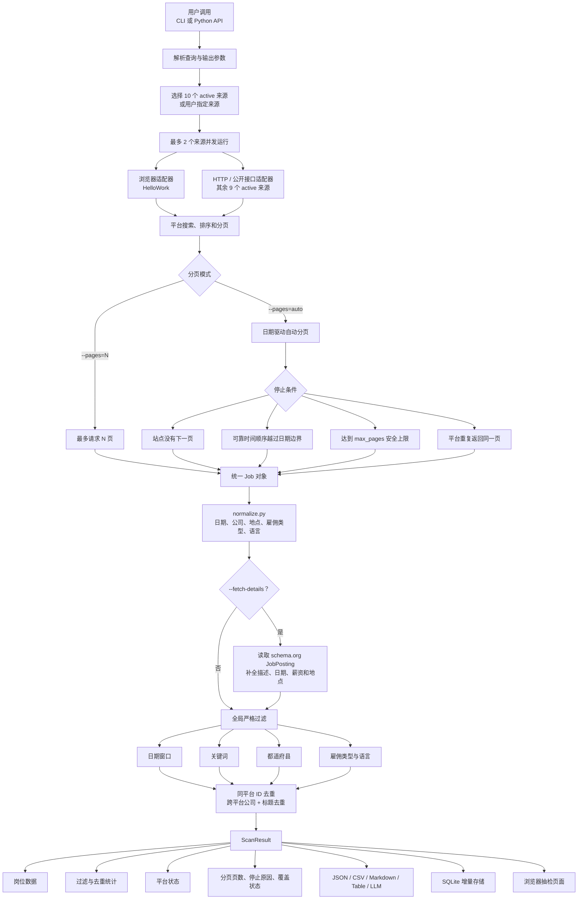
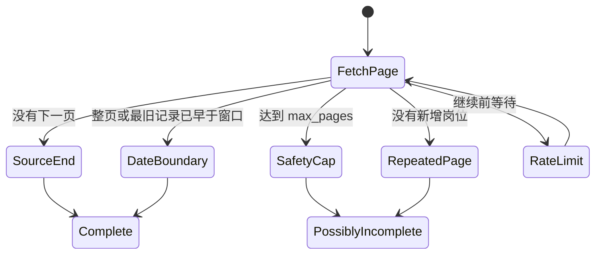

# jpjobs 0.4 架构与数据流程

本文描述当前优化版本从搜索参数、平台抓取、日期自动分页，到规范化、详情补全、
过滤、去重和输出的运行逻辑。

## 主流程



## 日期自动分页



不同平台不能使用同一种日期停止判断：

- 有服务端日期过滤的平台继续翻到接口结束；
- 有可靠 newest-first 顺序的平台在越过日期边界后停止；
- 默认相关性排序的平台遍历来源库存或到安全上限；
- 只有详情页日期的平台会探测每页最旧岗位的详情日期；
- 单页返回全部库存的平台不进行伪分页。

详见 [数据抽检与日期自动分页](./audit-and-auto-pagination.md)。

## 关键模块

| 模块 | 责任 |
|---|---|
| `cli.py` | 参数解析，包括 `--pages=auto` 和 `--max-pages` |
| `aggregate.py` | 来源并发、规范化、详情补全、全局过滤、去重和统计 |
| `pagination.py` | 共享页数预算、日期边界和覆盖状态判定 |
| `sources/*.py` | 平台查询参数、排序、分页、列表解析与停止信号 |
| `enrich.py` | 解析 schema.org `JobPosting` 详情 |
| `normalize.py` | 统一文本、日期、公司、地点、雇佣与语言字段 |
| `filtering.py` | 跨平台一致的日期和查询条件后置过滤 |
| `storage.py` | SQLite run、job 和 sighting 增量记录 |
| `output.py` | JSON、CSV、Markdown、终端表格和 LLM 输出 |
| `experiments/build_audit_report.py` | 生成自包含人工抽检页面 |

## 覆盖状态的含义

每个 `SourceStats` 会返回：

```json
{
  "pages_fetched": 8,
  "pagination_stop_reasons": ["date_boundary"],
  "coverage_complete": true
}
```

- `true`：站点已结束、单页库存已完整返回，或可靠日期顺序已经越过窗口；
- `false`：安全上限或重复页使扫描提前停止，窗口内可能还有更多岗位；
- `null`：旧式或第三方来源没有报告分页证据。

这一区分避免把“成功请求了几页”误报成“已经抓全平台”。
